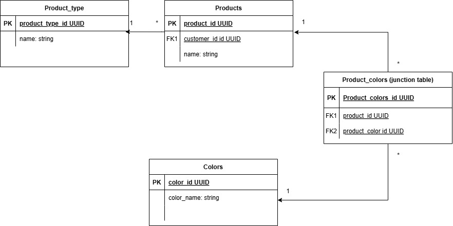

## Description

Backend for technical interview

## Prerequesites

node, docker and mongodb installed

## Compile and run the project
```bash
$ docker compose -f 'docker-compose.yml' up -d --build
```

and
```bash
$ yarn start
```

## Possible database change
This backend could just as well utilize a relational database using PostgreSQL. In that case the data would be modeled as this ER diagram:



## TODO
 - Add more unit testing. Both negative and positive (test that it throws when id is not valid and when an object is not found)
 - Add more e2e tests
 - Add Users maybe so it is clear who has created a new Ikea product. Different roles (admins can add new colours and product types)
 - Add productType props (description that could be inherited by products of that type). ProductType icon could also be relevant
 - Add colour hexcodes in database
